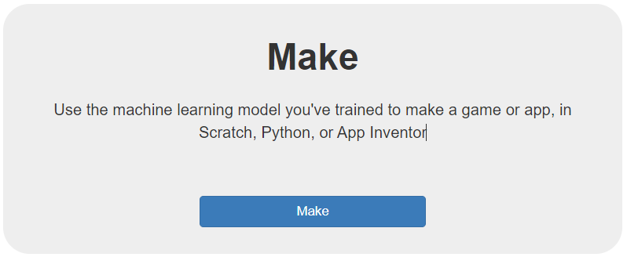

## 

Before you create your playlist generator app, train your model again to make sure you have all the 

--- task ---

Open the website [Machine Learning for Kids](https://machinelearningforkids.co.uk/#!/login).

--- /task ---

--- task ---

In the screen that appears, choose **Log In**. Enter your username and password on the next screen.

--- /task ---

--- task ---

Select Go to your Projects.

--- /task ---

--- task ---

On your projects page, select the model you want to train.

--- /task ---

--- task ---

Select Learn & Test.

--- /task ---
--- task ---

On your [**project page**](https://machinelearningforkids.co.uk/#!/projects){:target="_blank"}, select **Make**:

--- /task ---

A special fork of Scratch will open in a new tab. When it does, you will see an item in the left-hand menu with the same name as your machine learning project.

The new grey blocks you can see in that menu allow you to access your machine learning model from within your project:

{:width="100px"}

### Add the Spotify extension
--- task ---

Select the blue Extensions button at the bottom left of your screen.

--- /task ---

--- task ---

Scroll down the page and select the `Spotify`{:class="block3flag"} extension.

You will see it add several new green blocks, allowing you access to Spotify’s music and database.

--- /task ---

You’re now all set up and ready to code!