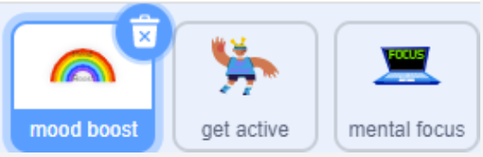

## Set your playlist length

<p style='border-left: solid; border-width:10px; border-color: #0faeb0; background-color: aliceblue; padding: 10px;'>
In this step, you will create the code that sets the length of the playlist and chooses the genre to search for songs.
</p>

--- task ---

To get started, delete the cat sprite by clicking the little bin icon on its tile beneath the stage.


--- /task ---

--- task ---

Add new sprites for each of your classes, but don’t include one for reject. 
It’s a good idea to use similar sprites to your previous project, so your user doesn’t get confused.



--- collapse ---
---
title: Re-use the sprites from your previous app
---

You can easily re-use your sprites from the classifier application by right-clicking (two-finger click on Mac) on its thumbnail beneath the stage and choosing export. Your sprite will download to your computer. Do this with all your sprites except reject (you won't need it for this app).


In your new project, choose the Upload Sprite option from the Add Sprite menu at the bottom right of your screen. Select your sprites in the window that appears and click OK.


**Note:** You’ll need to remove any code left on your uploaded sprites before moving on.

--- /collapse ---

--- /task ---

Now you’re ready to start making your playlist generator application. 

You’re going to create the code for one sprite, then duplicate it to the rest by dragging it across to the thumbnail under the stage. Once every sprite has the scripts they need, you’ll change some details on each sprite so they aren’t all creating the same playlist.

--- task ---

Add a `When this sprite clicked`{:class="block3events"} block to your first sprite.

```blocks3
when this sprite clicked

```

--- /task ---

--- task ---

Select the orange `Variables`{:class="block3variables"} menu and click on the Make a list button below the orange blocks:


--- /task ---

--- task ---

In the pop-up that appears, type `Playlist` and click **OK**.
You will see several new orange blocks appear in the `Variables`{:class="block3variables"} menu.


--- /task ---

--- task ---

From these new blocks, add a `delete all of [Playlist]`{:class="block3variables"} block, to make sure we remove any old playlists from a previous session.

```blocks3
when this sprite clicked
delete all of [playlist v]
```

--- /task ---

--- task ---

From the Sensing menu, add a `ask( ) and wait`{:class="block3sensing"} block. 
Change the text in the field to ask your user how many songs they want in their playlist:

```blocks3
when this sprite clicked
delete all of [playlist v]
ask (How many songs would you like?) and wait
```

--- /task ---

--- task ---

Select the `Variables`{:class="block3variables"} menu again and make a new variable called `length`.


--- /task ---

--- task ---

From the same menu, add a `set [length] to (0)`{:class="block3variables"} block:

```blocks3
when this sprite clicked
delete all of [playlist v]
ask (How many songs would you like?) and wait
set [length v] to [0]
```

--- /task ---

--- task ---

Select the `Sensing`{:class="block3sensing"} menu and drag the blue answer bubble into the hole in the last block:

```blocks3
when this sprite clicked
delete all of [playlist v]
ask (How many songs would you like?) and wait
set [length v] to (answer)
```

--- /task ---

--- task ---

**Click the sprite.** 
You will see a pop-up appear in your stage asking you for input.


--- /task ---

--- task ---

Type something into the field and press **Enter**.
You should see your length variable change to what you typed:


--- /task ---

**Note:**
+ Typing anything other than a number into the length field will result in an error, later in your application.
+ Typing anything other than a recognised genre on Spotify will result in no music being found on the database.

--- /task ---

The next part of your script will use the playlist length your user requests, to search for music that fits your class. It will keep searching until it finds the number of songs on the database which fit your user’s requested playlist.