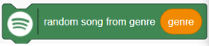
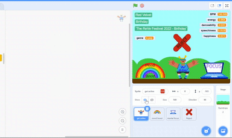

## Compare songs with your model

<p style='border-left: solid; border-width:10px; border-color: #0faeb0; background-color: aliceblue; padding: 10px;'>
Compare the songs found on the music database to the predicted audio features from your trained ML model. 
</p>

To generate a playlist, the script should now:

1. Compare the random song it finds to your `reject` class, to see if you will dislike it - if it’s a song you’ll dislike, it should be rejected immediately.

2. If the song is one you *won’t* dislike, it then needs to be compared to your chosen class (the playlist type) to see if it’s a song that **matches the pattern your model predicts**. If not, it should be rejected at this stage. 

3. If the song is one you might like *and* one which fits your model’s prediction, it needs to be added to a list of song information (the Playlist). The application should also play back the song that gets added to the playlist at the time, so your user can hear what the model is selecting. 

--- task ---

From the golden `Control`{:class="block3control"} menu, add an `if / else`{:class="block3control"} block, beneath the green `random song from genre`{:class="block3flag"} block:

```blocks3
when green flag clicked
ask [What's your name?] and wait
```

--- /task ---

--- task ---

From the green `Operators`{:class="block3operators"} menu, add an `equals`{:class="block3operators"} block to the slot in the `if / else`{:class="block3control"} block:

```blocks3
when this sprite clicked
delete all of [playlist v]
ask [How many songs would you like?] and wait
set [length v] to (answer)
ask [What genre would you like?] and wait
set [genre v] to (answer)
repeat until <(length of [Playlist v])=(length)>
random song from genre (genre) :: #338854
if <<>=<50>> then
else

```

--- /task ---

--- task ---

Open the ML4Kids menu and look for the grey `reject` bubble. 
Drop it into the first slot on the `equals`{:class="block3operators"} block:

```blocks3
when this sprite clicked
delete all of [playlist v]
ask [How many songs would you like?] and wait
set [length v] to (answer)
ask [What genre would you like?] and wait
set [genre v] to (answer)
repeat until <(length of [Playlist v])=(length)>
random song from genre (genre) :: #338854
if <(reject :: #4b4c60)=<50>> then
else
```

--- /task ---

--- task ---

At the top of the same ML4Kids menu, you will see two longer grey bubbles.
Drop the top one (it ends with (label)) into the second slot of your `equals`{:class="block3operators"} block: 

```blocks3
when this sprite clicked
delete all of [playlist v]
ask [How many songs would you like?] and wait
set [length v] to (answer)
ask [What genre would you like?] and wait
set [genre v] to (answer)
repeat until <(length of [Playlist v])=(length)>
random song from genre (genre) :: #338854
if <(reject :: #4b4c60)=(recognise numbers acousticness() danceability() energy() label :: #4b4c60)> then
else
```

--- /task ---

--- task ---

Choose the green `Spotify`{:class="block3flag"} menu, and into the long grey bubble, add the green bubbles for each audio feature. 

**Make sure that you get them in the right order!**

**Pro Tip:** If your block is too long, you can zoom the workspace out with the magnifying glass if you need to, and can scroll it using the bars at the bottom and right.

```blocks3
when this sprite clicked
delete all of [playlist v]
ask [How many songs would you like?] and wait
set [length v] to (answer)
ask [What genre would you like?] and wait
set [genre v] to (answer)
repeat until <(length of [Playlist v])=(length)>
random song from genre (genre) :: #338854
if <(reject :: #4b4c60)=(recognise numbers acousticness(Song [acousticness score v] :: #338854) danceability(Song [danceability v] :: #338854) energy(Song [energy v] :: #338854) \(label\) :: #4b4c60)> then
else
```

--- /task ---

--- task ---

If the song found matches the description of a song that fits the `reject` class, we **shouldn’t** add it to the playlist. 
Instead, add a sound and use it as audio feedback to the user that a song has been rejected by adding a `start sound ()`{:class="block3sounds"} block: 

[[[generic-scratch3-sound-from-library]]]

```blocks3
when this sprite clicked
delete all of [playlist v]
ask [How many songs would you like?] and wait
set [length v] to (answer)
ask [What genre would you like?] and wait
set [genre v] to (answer)
repeat until <(length of [Playlist v])=(length)>
random song from genre (genre) :: #338854
if <(reject :: #4b4c60)=(recognise numbers acousticness(Song [acousticness score v] :: #338854) danceability(Song [danceability v] :: #338854) energy(Song [energy v] :: #338854) \(label\) :: #4b4c60)> then
play sound [boing v]
else
```
--- /task ---

--- task ---

If the song doesn’t get rejected, it needs to be compared against the class your user has requested to see if it matches.
Add another `if / else`{:class="block3control"} block into the else space in your script:

```blocks3
when this sprite clicked
delete all of [playlist v]
ask [How many songs would you like?] and wait
set [length v] to (answer)
ask [What genre would you like?] and wait
set [genre v] to (answer)
repeat until <(length of [Playlist v])=(length)>
random song from genre (genre) :: #338854
if <(reject :: #4b4c60)=(recognise numbers acousticness(Song [acousticness score v] :: #338854) danceability(Song [danceability v] :: #338854) energy(Song [energy v] :: #338854) \(label\) :: #4b4c60)> then
play sound [boing v]
else
if <> then
else
```

--- /task ---

--- task ---

Right click on the `=` symbol on the green operator block and **Duplicate** it.
Place the duplicated gem-shaped operator into the slot in your new `if / else`{:class="block3control"} block.

Remove the grey `reject` bubble from the new operator so the first hole is empty:

```blocks3
when this sprite clicked
delete all of [playlist v]
ask [How many songs would you like?] and wait
set [length v] to (answer)
ask [What genre would you like?] and wait
set [genre v] to (answer)
repeat until <(length of [Playlist v])=(length)>
random song from genre (genre) :: #338854
if <(reject :: #4b4c60)=(recognise numbers acousticness(Song [acousticness score v] :: #338854) danceability(Song [danceability v] :: #338854) energy(Song [energy v] :: #338854) \(label\) :: #4b4c60)> then
play sound [boing v]
else
if <<>=(recognise numbers acousticness(Song [acousticness score v] :: #338854) danceability(Song [danceability v] :: #338854) energy(Song [energy v] :: #338854) \(label\) :: #4b4c60)> then
else
```
--- /task ---

--- task ---

From the `ML4Kids` menu, insert the grey bubble which matches the sprite/playlist you are working on (in this example it is `mood_boost`):

```blocks3
when this sprite clicked
delete all of [playlist v]
ask [How many songs would you like?] and wait
set [length v] to (answer)
ask [What genre would you like?] and wait
set [genre v] to (answer)
repeat until <(length of [Playlist v])=(length)>
random song from genre (genre) :: #338854
if <(reject :: #4b4c60)=(recognise numbers acousticness(Song [acousticness score v] :: #338854) danceability(Song [danceability v] :: #338854) energy(Song [energy v] :: #338854) \(label\) :: #4b4c60)> then
play sound [boing v]
else
if <(mood_boost :: #4b4c60)=(recognise numbers acousticness(Song [acousticness score v] :: #338854) danceability(Song [danceability v] :: #338854) energy(Song [energy v] :: #338854) \(label\) :: #4b4c60)> then // Change the first bubble to match the sprite you are coding
else
```

--- /task ---

This new `if` statement is now comparing the song that wasn’t rejected against the requested class. 
If it fits the class, it should be added to the Playlist. If not, it should be rejected again.

--- task ---

From the orange `Variables`{:class="block3variables"} menu, scroll down and place an `add (thing) to [Playlist]`{:class="block3variables"} block into the `if` space:

```blocks3
when this sprite clicked
delete all of [playlist v]
ask [How many songs would you like?] and wait
set [length v] to (answer)
ask [What genre would you like?] and wait
set [genre v] to (answer)
repeat until <(length of [Playlist v])=(length)>
random song from genre (genre) :: #338854
if <(reject :: #4b4c60)=(recognise numbers acousticness(Song [acousticness score v] :: #338854) danceability(Song [danceability v] :: #338854) energy(Song [energy v] :: #338854) \(label\) :: #4b4c60)> then
play sound [boing v]
else
if <(mood_boost :: #4b4c60)=(recognise numbers acousticness(Song [acousticness score v] :: #338854) danceability(Song [danceability v] :: #338854) energy(Song [energy v] :: #338854) \(label\) :: #4b4c60)> then // Change the first bubble to match the sprite you are coding
add [thing] to [Playlist v]
else
```


--- /task ---

These instructions will set up the **string** that will be added to the playlist. It should have the **artist information** and **song title** so that the song can be searched in the database

--- task ---

From the `Operators`{:class="block3operators"} menu, place a `join (apple) (banana)`{:class="block3operators"} block into the empty slot of the new block:

```blocks3
when this sprite clicked
delete all of [playlist v]
ask [How many songs would you like?] and wait
set [length v] to (answer)
ask [What genre would you like?] and wait
set [genre v] to (answer)
repeat until <(length of [Playlist v])=(length)>
random song from genre (genre) :: #338854
if <(reject :: #4b4c60)=(recognise numbers acousticness(Song [acousticness score v] :: #338854) danceability(Song [danceability v] :: #338854) energy(Song [energy v] :: #338854) \(label\) :: #4b4c60)> then
play sound [boing v]
else
if <(mood_boost :: #4b4c60)=(recognise numbers acousticness(Song [acousticness score v] :: #338854) danceability(Song [danceability v] :: #338854) energy(Song [energy v] :: #338854) \(label\) :: #4b4c60)> then // Change the first bubble to match the sprite you are coding
add (join [apple] [banana]) to [Playlist v]
else
```

--- /task ---

--- task ---

Place a second `join (apple) (banana)`{:class="block3operators"} block into the **second** slot of the first join block:

```blocks3
when this sprite clicked
delete all of [playlist v]
ask [How many songs would you like?] and wait
set [length v] to (answer)
ask [What genre would you like?] and wait
set [genre v] to (answer)
repeat until <(length of [Playlist v])=(length)>
random song from genre (genre) :: #338854
if <(reject :: #4b4c60)=(recognise numbers acousticness(Song [acousticness score v] :: #338854) danceability(Song [danceability v] :: #338854) energy(Song [energy v] :: #338854) \(label\) :: #4b4c60)> then
play sound [boing v]
else
if <(mood_boost :: #4b4c60)=(recognise numbers acousticness(Song [acousticness score v] :: #338854) danceability(Song [danceability v] :: #338854) energy(Song [energy v] :: #338854) \(label\) :: #4b4c60)> then // Change the first bubble to match the sprite you are coding
add (join (join [apple] [banana]) [banana]) to [Playlist v]
else
```

--- /task ---

--- task ---

From the green `Spotify`{:class="block3flag"} menu, add an `artist`{:class="block3flag"} bubble to the **first** slot of the three empty slots:

```blocks3
when this sprite clicked
delete all of [playlist v]
ask [How many songs would you like?] and wait
set [length v] to (answer)
ask [What genre would you like?] and wait
set [genre v] to (answer)
repeat until <(length of [Playlist v])=(length)>
random song from genre (genre) :: #338854
if <(reject :: #4b4c60)=(recognise numbers acousticness(Song [acousticness score v] :: #338854) danceability(Song [danceability v] :: #338854) energy(Song [energy v] :: #338854) \(label\) :: #4b4c60)> then
play sound [boing v]
else
if <(mood_boost :: #4b4c60)=(recognise numbers acousticness(Song [acousticness score v] :: #338854) danceability(Song [danceability v] :: #338854) energy(Song [energy v] :: #338854) \(label\) :: #4b4c60)> then // Change the first bubble to match the sprite you are coding
add (join (join (artist :: #338854) [banana]) [banana]) to [Playlist v]
else
```

--- /task ---

--- task ---

Into the second slot, add a hyphen with a space either side of it:

```blocks3
when this sprite clicked
delete all of [playlist v]
ask [How many songs would you like?] and wait
set [length v] to (answer)
ask [What genre would you like?] and wait
set [genre v] to (answer)
repeat until <(length of [Playlist v])=(length)>
random song from genre (genre) :: #338854
if <(reject :: #4b4c60)=(recognise numbers acousticness(Song [acousticness score v] :: #338854) danceability(Song [danceability v] :: #338854) energy(Song [energy v] :: #338854) \(label\) :: #4b4c60)> then
play sound [boing v]
else
if <(mood_boost :: #4b4c60)=(recognise numbers acousticness(Song [acousticness score v] :: #338854) danceability(Song [danceability v] :: #338854) energy(Song [energy v] :: #338854) \(label\) :: #4b4c60)> then // Change the first bubble to match the sprite you are coding
add (join (join (artist :: #338854) [ - ]) [banana]) to [Playlist v]
else
```

--- /task ---

--- task ---

From the green Spotify menu, add a song title bubble to the last slot of the three empty slots:

```blocks3
when this sprite clicked
delete all of [playlist v]
ask [How many songs would you like?] and wait
set [length v] to (answer)
ask [What genre would you like?] and wait
set [genre v] to (answer)
repeat until <(length of [Playlist v])=(length)>
random song from genre (genre) :: #338854
if <(reject :: #4b4c60)=(recognise numbers acousticness(Song [acousticness score v] :: #338854) danceability(Song [danceability v] :: #338854) energy(Song [energy v] :: #338854) \(label\) :: #4b4c60)> then
play sound [boing v]
else
if <(mood_boost :: #4b4c60)=(recognise numbers acousticness(Song [acousticness score v] :: #338854) danceability(Song [danceability v] :: #338854) energy(Song [energy v] :: #338854) \(label\) :: #4b4c60)> then // Change the first bubble to match the sprite you are coding
add (join (join (artist :: #338854) [ - ]) (song title :: #338854)) to [Playlist v]
else
```
--- /task ---

--- task ---

The application should now play a sample of the song added to the playlist. 
From the Spotify menu, add a play preview block under the orange add to playlist block:

```blocks3
when this sprite clicked
delete all of [playlist v]
ask [How many songs would you like?] and wait
set [length v] to (answer)
ask [What genre would you like?] and wait
set [genre v] to (answer)
repeat until <(length of [Playlist v])=(length)>
random song from genre (genre) :: #338854
if <(reject :: #4b4c60)=(recognise numbers acousticness(Song [acousticness score v] :: #338854) danceability(Song [danceability v] :: #338854) energy(Song [energy v] :: #338854) \(label\) :: #4b4c60)> then
play sound [boing v]
else
if <(mood_boost :: #4b4c60)=(recognise numbers acousticness(Song [acousticness score v] :: #338854) danceability(Song [danceability v] :: #338854) energy(Song [energy v] :: #338854) \(label\) :: #4b4c60)> then // Change the first bubble to match the sprite you are coding
add (join (join (artist :: #338854) [ - ]) (song title :: #338854)) to [Playlist v]
play preview :: #338854
else
```
--- /task ---

--- task ---

From the purple Sound menu, place a `start sound ()`{:class="blocks3sounds"} block into the empty `else` slot of the block, to give audio feedback to the user that another song has been rejected:

```blocks3
when this sprite clicked
delete all of [playlist v]
ask [How many songs would you like?] and wait
set [length v] to (answer)
ask [What genre would you like?] and wait
set [genre v] to (answer)
repeat until <(length of [Playlist v])=(length)>
random song from genre (genre) :: #338854
if <(reject :: #4b4c60)=(recognise numbers acousticness(Song [acousticness score v] :: #338854) danceability(Song [danceability v] :: #338854) energy(Song [energy v] :: #338854) \(label\) :: #4b4c60)> then
play sound [boing v]
else
if <(mood_boost :: #4b4c60)=(recognise numbers acousticness(Song [acousticness score v] :: #338854) danceability(Song [danceability v] :: #338854) energy(Song [energy v] :: #338854) \(label\) :: #4b4c60)> then // Change the first bubble to match the sprite you are coding
add (join (join (artist :: #338854) [ - ]) (song title :: #338854)) to [Playlist v]
play preview :: #338854
else
play sound [boing v]
```
--- /task ---

--- task ---

**Click the Sprite** you are working on in the Stage.

--- /task ---

You should see the song information readouts show details about the artist and song title, and begin hearing the sound effect you added when songs are rejected.

Let it run for a while and you should start to see song names being added to your Playlist in the workspace.

### Test and Debug

--- collapse ---
---
title: Your app isn’t adding songs to the Playlist
---

Your app is rejecting everything:
+ Have you inserted the correct ML4Kids bubbles in your comparisons? The first one should have reject, while the second should show the playlist name:


Your app is finding songs, but not adding them to the list:
+ Have you got `Playlist` selected as the value in the orange `add (artist - song title) to Playlist`{:class="block3variables"} block pull-down menu?

--- /collapse ---

--- collapse ---
---
title: You can’t hear anything playing
---

Check the cyan coloured song information readouts when you run your app. **Are they showing any information, or are they blank?** Use the ticks to show or hide them:


1. The readouts are blank: your program hasn’t found a song on the music database.
2. The readouts show information about the song, artist and album: your program is playing a song, but you can’t hear it.
 
**Your app hasn’t found a song on the music database:**
+ Have you correctly spelled the genre you want to search? Misspellings will result in your search returning nothing.
+ Have you inserted the genre bubble in the random song from genre block? It should look like this: 


**Your app is playing a song, but you can’t hear anything:**
+ Make sure your headphones are properly plugged in (if you have them), and that your sound is turned on.

--- /collapse ---

--- task ---

Once you have made sure your code is working on this sprite, **Drag and drop** the script onto your other sprites to duplicate it.



--- /task ---

--- task ---

You will also need to change the grey ML4K bubble which compares the song to the sprite's class **on every sprite**:

```blocks3
when this sprite clicked
delete all of [playlist v]
ask [How many songs would you like?] and wait
set [length v] to (answer)
ask [What genre would you like?] and wait
set [genre v] to (answer)
repeat until <(length of [Playlist v])=(length)>
random song from genre (genre) :: #338854
if <(reject :: #4b4c60)=(recognise numbers acousticness(Song [acousticness score v] :: #338854) danceability(Song [danceability v] :: #338854) energy(Song [energy v] :: #338854) \(label) :: #4b4c60)> then
play sound [boing v]
else
if <(mood_boost :: #4b4c60)=(recognise numbers acousticness(Song [acousticness score v] :: #338854) danceability(Song [danceability v] :: #338854) energy(Song [energy v] :: #338854) \(label\) :: #4b4c60)> then // Change the first bubble to match the sprite you are coding on EVERY sprite in your app
add (join (join (artist :: #338854) [ - ]) (song title :: #338854)) to [Playlist v]
play preview :: #338854
else
play sound [boing v]
```

--- /task ---


In the next step, you will add the functionality to play back your generated playlist!
