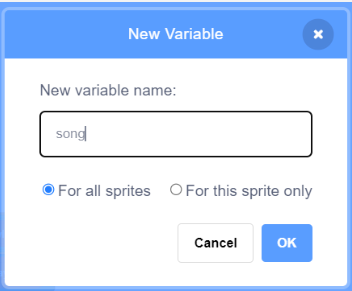
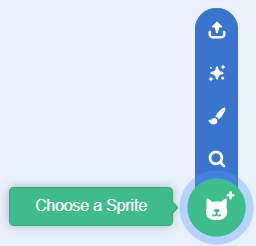

## Play back your playlist

<p style='border-left: solid; border-width:10px; border-color: #0faeb0; background-color: aliceblue; padding: 10px;'>
Once your application has created a list of song and artist information, you can use that list to search the music database for the song and play back the sample in Scratch. 
</p>

--- task ---

In the orange `Variables`{:class="block3variables"} menu, Make a variable called `song`:



This variable will keep track of which entry in your playlist is playing.

--- /task ---

--- task ---

Add a new sprite to your project. 
This sprite will be your ‘playback’ button.


--- /task ---

--- task ---

From the yellow Events menu, add a when this sprite clicked block:

```blocks3
when this sprite clicked
```

--- /task ---

--- task ---

Reset the song counter by adding a `set [song] to ( )`{:class="block3variables"} block from the orange `Variables`{:class="block3variables"} menu.
Change the number in the field to `1`:

```blocks3
when this sprite clicked
set [song v] to [1]
```

--- /task ---

Your script should play the songs in the playlist one after another. The variable you just created allows your app to assign numbers to the songs in the playlist and count along. 

To play the whole playlist, you will need to loop the playback of the songs.

--- task ---

From the golden `Control`{:class="block3control"} menu, add a `repeat`{:class="block3control"} block:

```blocks3
when this sprite clicked
set [song v] to [1]
repeat [10]
```

--- /task ---

--- task ---

Into the slot in the new block, add an orange `length`{:class="block3variables"} bubble from the `Variables`{:class="block3variables"} menu:
This will make sure the right number of songs get played.

```blocks3
when this sprite clicked
set [song v] to [1]
repeat (length)
```

--- /task ---

--- task ---

From the green `Spotify`{:class="block3flag"} menu, add a `search for (Brave, Sara Bareilles)`{:class="block3flag"} block and a `play preview`{:class="block3flag"} block: 

```blocks3
when this sprite clicked
set [song v] to [1]
repeat (length)
search for [Brave, Sara Bareilles] :: #338854
play preview :: #338854
```

--- /task ---

--- task ---

Go to the orange `Variables`{:class="block3variables"} menu and scroll down until you see an orange `item (1) of [Playlist]`{:class="block3variables"} bubble. Place it into the slot in your `search for`{:class="block3flag"} block:

```blocks3
when this sprite clicked
set [song v] to [1]
repeat (length)
search for (item [1] of [Playlist v]) :: #338854
play preview :: #338854
```

--- /task ---

--- task ---

Click the orange `Variables`{:class="block3variables"} menu and add a `song`{:class="block3variables"} bubble to the slot in the new orange `item (1) of [Playlist]`{:class="block3variables"} bubble:

```blocks3
when this sprite clicked
set [song v] to [1]
repeat (length)
search for (item (song) of [Playlist v]) :: #338854
play preview :: #338854
```

--- /task ---

--- task ---

Finally, add a `change [song] by (1)`{:class="block3variables"} block to your script, **inside** the `repeat (length)`{:class="block3control"} loop block:

```blocks3
when this sprite clicked
set [song v] to [1]
repeat (length)
search for (item (song) of [Playlist v]) :: #338854
play preview :: #338854
change [song v] by [1]
```

--- /task ---

--- task ---

**Click the Playback Sprite.** 

If you have a playlist generated, you should hear your music playing after a second. 

--- /task ---
